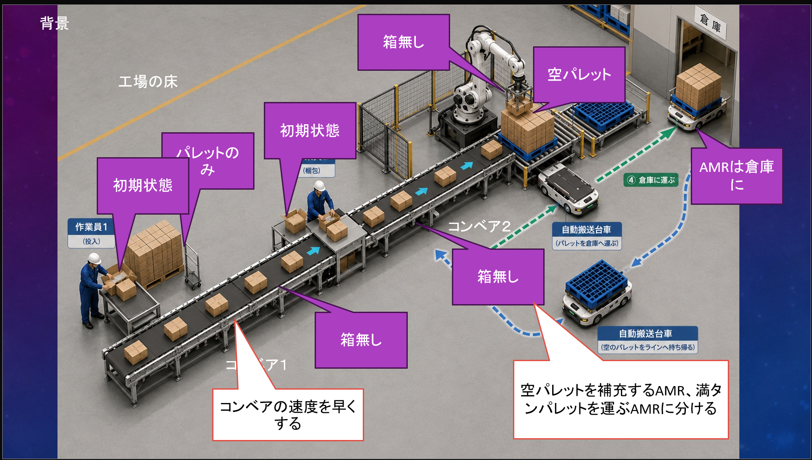
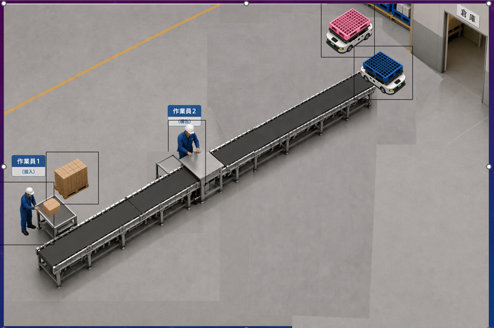
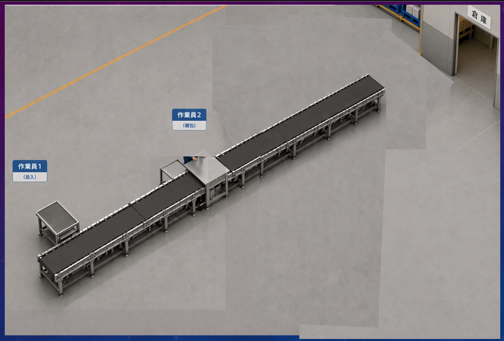

# factory-animation

## まず全体イメージを作る
 
## 可変にする部分に名前を領域を決める
 
## 可変になっている部分を消去（透明化）した背景を作る。
 
## 名前や領域ごとに、アニメーションの素材（コマ割り）を作る
 - 素材は透明なものと背景があるものの、両方を作る。使うの透明な背景のものだが位置合わせに背景が必要
 - 素材はAIに生成してもらうとよい
## 背景と素材を組み合わせていく
